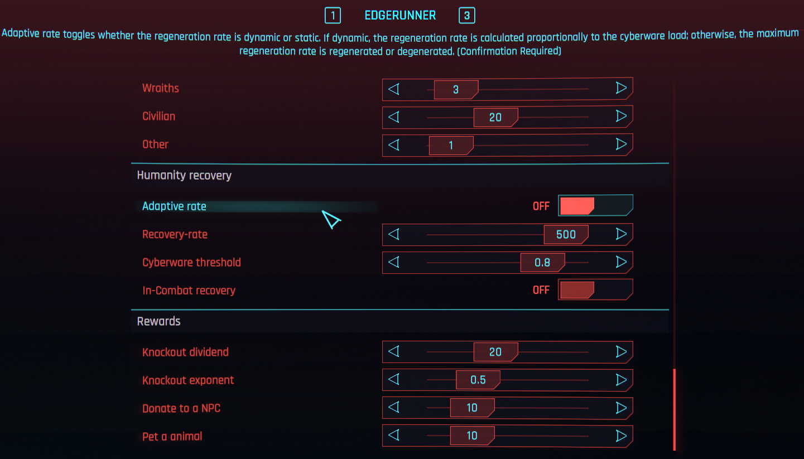
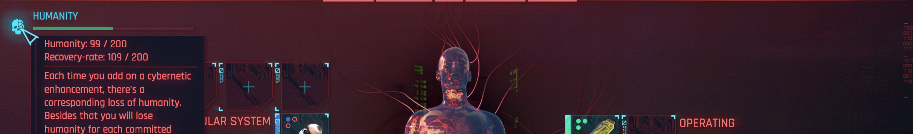

<p align="center">
     
</p>

# Wannabe Edgerunner - Humanity Recovery

**Find me on [NexusMods](https://www.nexusmods.com/cyberpunk2077/mods/6330).**
**Help with localization effort is much appreciated**

Extends the [Wannabe Edgerunner](https://www.nexusmods.com/cyberpunk2077/mods/5646) mod, to recover humanity over time.

## Features

Over time, humanity penalties inflicted due to murder slowly regenerates.

* Recover humanity throughout the day. Equipped cyberware reduces the recovery-rate proportionally to the number of slots filled. So that no humanity is recovered, when a certain threshold is reached. Below that threshold humanity degenerates.
* Knocking-out an opponent instead of killing them rewards humanity.
* Donating to a homeless person recovers humanity.
* Petting Nibbels recovers humanity. [WIP]


## Implementation details

Edgerunner lore states, that "laying off chrome" prevents Cyberpychosis. In the context of CP2077, this system interprets "laying off chrome" as emptying Cyberwear slots.

This mod provides a immersive and highly configurable experience of the regeneration.



### Recovery over time

The current regen or degen can be seen in the Cyberdeck/Ripperdoc screen.




Humanity recovery is calculated as a linear interpolation in two parts.

- If the **Cyberware load is higher than the threshold**, degens humanity proportional to the load over the threshold. Interpolates $$l \in [k,1] \rightarrow [0,-r]$$ where $l$ is the load, $k$ is the threshold (settings), and $r$ is the recovery rate (settings)

- If the **Cyberware load is lower than the threshold**, regens humanity proportional to the load under the threshold Interpolates $$l \in [0,k] \rightarrow [0,r]$$ where $l$ is the load, $k$ is the threshold (settings), and $r$ is the recovery rate (settings)

This is illustrated in the diagram below.
```
     thres
0 ---|------------- 1 load
|    /\
|   /    \
|  /        \
| /            \
|/                \
1 rate   -rate
```

Disabling adaptive recovery always uses the maximum recovery rate, positive or negative.

### Recovery on knockout

Humanity is recovered inversely proportional to the penalty incurred for the kill.

The amount of humanity recovered is given by the following equation. $$d / c ^ e$$ where $d$ is the dividend (settings), $c$ is the kill cost, and $e$ the exponent (settings).

A dividend of zero turns off recovery on knockout.


### TODO
- [ ] Fix bug where regeneration occurs on the game start screen, after load, before session start. [rn, circumvented by delay]
- [x] Prevent humanity regeneration during combat.
- [x] Add on screens when restoring humanity (like exp gained notifications)
- [x] Gain humanity when donating to the homeless
- [ ] Gain humanity upon certain quest completions (romance etc)
- [ ] Gain humanity when petting cats!
- [x] Add visual feedback when Cyberware load exceeds the threshold. (Tint humaniy bar red)
- [ ] Add ru-ru local
- [ ] Add cz-cz local
- [ ] Add it-it local
- [ ] Add jp-jp local
- [ ] Add pl-pl local
- [ ] Add pt-br local
- [ ] Add zh-cn local
- [ ] Add zh-tw local
- [ ] Add es-es local

## How to build

- Open .cpmodproj in WolvenKin
- MouseR on `raw`, then MouseL on "Convert from JSON"
- "Pack as REDmod" or "Install as REDmod" in toolbar
